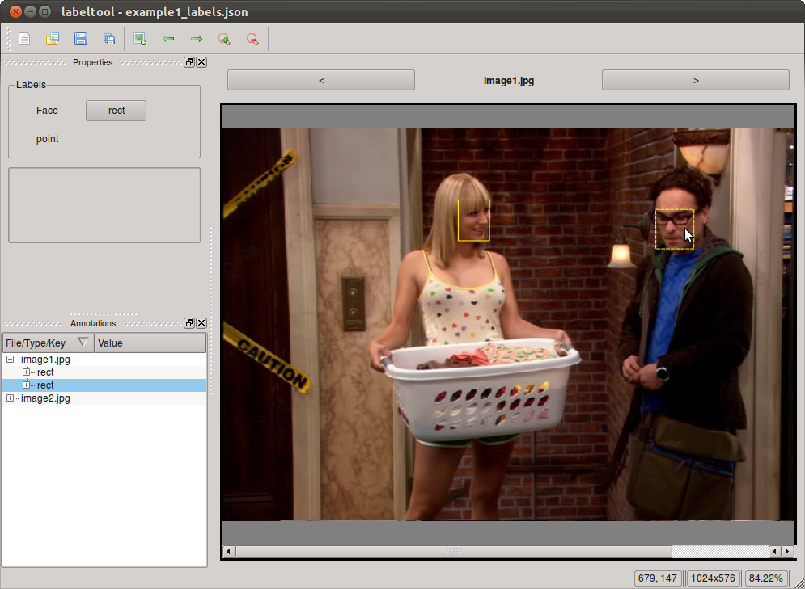

.. highlight:: python

===========
First Steps
===========

In this section, you will learn with a simple example, how to load labels and
write a simple configuration file.  The full configuration options will be
covered in the next section :doc:`configuration`.

Using the default configuration
===============================

The easiest way to start Sloth is by using a supported label format and
supported label types only.  In that case we just need to start Sloth and
supply the label file as parameter on the command line::

    sloth examples/example1_labels.json

``example1_labels.json`` comes with Sloth in the example directory for you
to try out directly.  Once the label file is loaded, Sloth should look
somewhat similar to the following image.

Let's take look at the example label file::

    [
        {
            "class": "image",
            "filename": "image1.jpg",
            "annotations": [
                {
                    "class": "rect",
                    "height": 60.0, 
                    "width": 46.0, 
                    "y": 105.0, 
                    "x": 346.0
                }, 
                {
                    "class": "rect",
                    "height": 58.0, 
                    "width": 56.0, 
                    "y": 119.0, 
                    "x": 636.0
                }
            ] 
        }, 
        {
            "class": "image", 
            "filename": "image2.jpg",
            "annotations": [
                {
                    "class": "point",
                    "y": 155.0, 
                    "x": 409.0
                }
            ] 
        }
    ]

We have labeled two images with filenames ``image1.jpg`` and ``image2.jpg``,
with two rectangles in image 1 and one point in image 2.  Since we launched
Sloth without a custom configuration, the standard visualizations for ``rect``
and ``point`` will be used. Sloth displays two rectangles at the labeled
positions in image1, and a point in image2.

Adding and editing annotations in the GUI
=========================================

Editing existing annotations
----------------------------

Let's start by editing existing labels.  There are several ways in which 
existing labels can be modified.  You first need to select the label which
you want to modify.  You can do this by clicking on the label, e.g. in our
example label file you can click somewhere inside the area of one of the
rectangles in image 1.  The label outline changes to a dashed line, indicating
that is has been selected.  Another way to select labels is to press the TAB-key
multiple times.  This cycles the selection through all labels in the current
image. Here too, the currently selected item is indicated by a dashed outline.

Once the label is selected, we can modify its position dragging the item to its
new location while holding the left mouse button down.  This applies to both
rectangle and point labels.

In order to modify the width and height of the rectangle, you can click inside
the rectangle with the right mouse button and drag while holding down the right
mouse button.  This changes the width and height of the rectangle.

We strongly belief that in many cases a labeling task can be carried out more
efficiently by using the keyboard instead of the mouse.  Therefore, the
builtin standard label items can all be modified using the keyboard only.

The position of a label item can be modified with the LEFT, RIGHT, UP and DOWN
keys with pixel-accuracy.  If you hold down the SHIFT-key, the step size is
increased to 5-pixel steps.

The width and height of a rectangle can further be modified by holding down the
CTRL-key, and then using the LEFT, RIGHT, UP and DOWN buttons, respectively.
Again, holding in addition also the SHIFT key increases the step size to 5 pixels

Adding new annotations
----------------------

For each of the label types, there is a button in the Properties dock (by default
on the left of the window).  Click on this button to change into *insert*-mode.
You will now be able to add new label item by clicking and drawing on the current
image.

The insert-mode for a particular label type can also be activated by a hotkey.
The standard hotkeys for rectangle labels is ``r``, and for point labels ``p``.

Writing a custom configuration
==============================

We already briefly touch the subject of configuration.  Sloth can be easily
tailored to ones labeling needs by using different label types, adding own
visualization items and container formats.  All of this can be specified in the
configuration file.  The configuration file is a python module where the
module-level variables represent the settings.  The most important variable is

* :ref:`LABELS`:    This defines how sloth will display annotations and how the
  user can insert new ones.

We start with a quick example::

    LABELS = (
        {"attributes": {"type":  "rect",
                        "class": "head",
                        "id":    ["Martin", "Mika"]},
         "item":     "sloth.items.RectItem",
         "inserter": "sloth.items.RectItemInserter",
         "text":     "Head"
        },

        {"attributes": {"type":  "point",
                        "class": "left_eye",
                        "id":    ["Martin", "Mika"]},
         "item":     "sloth.items.PointItem",
         "inserter": "sloth.items.PointItemInserter",
         "text":     "Left Eye"
        },

        {"attributes": {"type":  "point",
                        "class": "right_eye",
                        "id":    ["Martin", "Mika"]},
         "item":     "sloth.items.PointItem",
         "inserter": "sloth.items.PointItemInserter",
         "text":     "Right Eye"
        },
    )

``LABELS`` is a tuple/list of dictionaries.  Each dictionary describes how one
annotation type is (i) inserted, (ii) visualized and (iii) modified.  Let's go over the
different keys of the dictionary in detail:

* ``text``:  This is a text that describes the label type, and will be
  used as label description in the Properties dock.

* ``item`` specifies which class is responsible for visualizing the annotation.
  For the first annotation type in our example, the predefined
  ``sloth.items.RectItem`` class is used, which will draw a rectangle as given by the
  coordinates in the annotation.  Sloth comes with several predefined
  visualization classes, such as ``sloth.items.RectItem`` and
  ``sloth.items.PointItem`` (see :doc:`items` for a full list).  However, it is
  also very easy to define your own visualization class (see :ref:`CUSTOM_ITEMS`).

* ``inserter`` specifies which class is responsible for creating new
  annotations based on user input.  When the user enters insert-mode with a
  given label type, the corresponding inserter is captures all
  user input and takes care of the creation of a new annotation.

* ``attributes`` has three purposes:

  1. It defines which key-values pairs are inserted into a new annotation directly.
     This can either be a fixed key-value pair.  If the value is a list of
     items, the user can choose interactively in the Properties dock which one
     of the values he wants to use for a new label.  The current state is then
     passed to the inserter.

  2. It defines how a existing annotations can be edited.  Fixed
     key-value pairs, are not allowed to be edited.  If the value for a given
     key is a list of items, the user can choose interactively between the
     values for the corresponding key.  The annotation is then updated
     accordingly.

  3. It defines how to match an existing annotation to one of the entries in ``LABELS``.
     Sloth uses a soft matching based on the two keys ``class`` and ``type``.  It checks
     each item in ``LABELS`` starting from the beginning and stops if it finds the first
     match.  An entry matches an annotation if:

       * the values for both the ``class`` and ``type`` keys match, or
       * the value for one of keys matches and the other key is not present in
         either ``attributes`` or the annotation.

You need to save your custom configuration in a file ending with ``.py``.  To use it,
pass it to Sloth with the ``--config`` command line parameter::

    sloth --config myconfig.py examples/example1_labels.json

You can now start labeling head locations and eye positions.  You'll see that --
depending on the chosen annotation -- you can either insert a rectangle (this is internally
done by the ``RectItemInserter``) or points (using the ``PointItemInserter``).  For
each annotation you can choose an identity from the two supplied options.

There are more possibilities to configure the labels, which we have not touched here.
For example, hotkeys can be defined to quick access to often used label types.
Refer to :ref:`LABELS` for the full documentation.

Apart from defining the supported labels in the configuration, other parts of Sloth's
behaviour can be configured there as well, e.g. for supporting custom label formats (using
custom containers).  See :doc:`Configuration <configuration>` for the full
reference of all configuration options.

Next steps
==========

You should quickly familiarize yourself with the :doc:`basic concepts and conventions <concepts>` in Sloth.
Continue then by reading about :doc:`all available configuration options <configuration>`,
how to write your own :doc:`visualization items <items>`, :doc:`custom inserters <inserters>` or
:doc:`custom label containers <containers>`.

