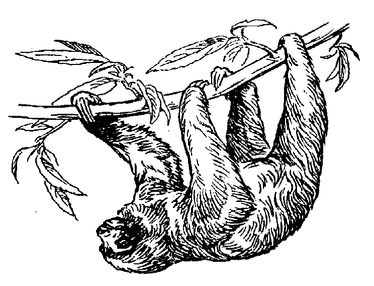

=================================
Welcome to Sloth's documentation!
=================================

This is the documentation of Sloth.  Sloth's purpose is to provide a versatile
tool for various labeling tasks in the context of computer vision research.
Since there are so many different label formats and requirements out there, we
concluded that is virtually impossible to build *the one* label tool sufficient
to handle all labeling tasks.  Therefore, this project can be seen rather as a
framework and set of standard components to quickly configure a label tool
specificly tailored to ones needs.

In this documentation we will go over some of the key concepts of Sloth, how to
configure Sloth using the standard components provided in the package, and
finally how to go further and write custom visualization items and label
format containers to deal with specific labeling needs.

Feedback
========

*Please* provide feedback to us on this document and Sloth in general!  We won't be able
to incorporate your required features if you do not talk to us.  Also, use the bug tracker
at https://github.com/cvhciKIT/sloth/issues.  Of course, pull requests are always welcome!

Contents
========

.. toctree::
   :maxdepth: 2

   installation
   first_steps
   concepts
   configuration
   items
   inserters
   containers
   examples
   api/index

Indices and tables
==================

* :ref:`genindex`
* :ref:`modindex`
* :ref:`search`

